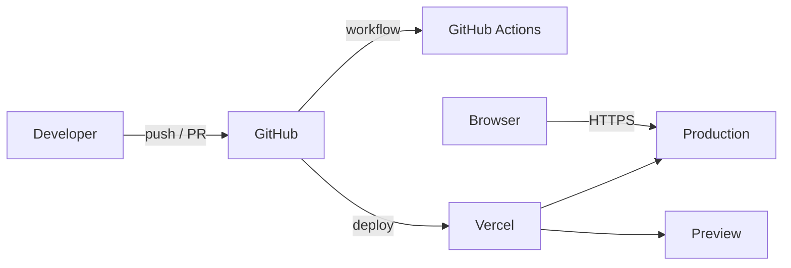

# YMS Studio Web

A web project built with Next.js and TypeScript, deployed on Vercel.

**Live site:** https://ymsstudio.vercel.app

## Tech Stack

| Area | Technology |
|------|------------|
| Framework | Next.js (App Router) |
| Language | TypeScript |
| UI components | shadcn/ui (`components.json`) |
| Styling | CSS, PostCSS |
| Analytics | Google Tag |
| CI | GitHub Actions |
| Hosting | Vercel (Production and Preview deployments) |
| Package manager | pnpm (npm also supported) |

## Architecture



- **Routing and pages**: the `app` directory uses the Next.js App Router.
- **UI**: reusable components live in `components`, with shared state and logic in `hooks`.
- **Shared code**: helpers and utilities live in `lib`.
- **Deployment**: pushes to `main` deploy to Production, and pull requests get Preview deployments on Vercel.

## Project Structure

```
├── .github/workflows   # CI workflows
├── app                 # Routes, layouts, and pages (App Router)
├── components          # UI components
├── hooks               # Custom React hooks
├── lib                 # Utilities and helpers
├── public              # Static assets
├── styles              # Global styles
├── components.json     # shadcn/ui configuration
├── next.config.mjs     # Next.js configuration
├── postcss.config.mjs  # PostCSS configuration
└── tsconfig.json       # TypeScript configuration
```

## Getting Started

Requirements: Node.js and pnpm.

```bash
# Install dependencies
pnpm install

# Start the development server
pnpm dev
```

The app will be available at `http://localhost:3000`.

Build and run for production:

```bash
pnpm build
pnpm start
```
